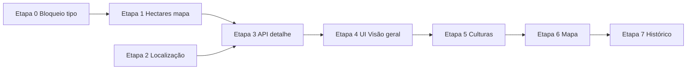

# [EPIC] Lapidação — Fazendas, Regras de Tipo, Mapa e Tela de Detalhe

Tipo:        Epic  
Prioridade:  🔺 Highest  
Categoria:   Backend, Frontend, Banco de Dados, UX  
Relator:     (preencher)  
Data Limite: (preencher)

## 📌 Status auditado no código (maio/2026 — atualizado 20/05/2026)

| Item | Situação atual |
|------|----------------|
| Tipos `tipo_fazenda` no Prisma | ✅ `PROPRIA`, `ARRENDADA_DE_TERCEIROS`, `ARRENDADA_PARA_TERCEIROS` |
| Bloqueio operacional por tipo | ✅ `assertFazendaOperavel` + `podeOperar` / `somenteLeitura` (Etapa 0) |
| Hectares “oficiais” da fazenda | ✅ `hectaresMapeados` = soma `poligonos_fazenda` (Etapa 1) |
| Validação “fazenda não pode ter 0 ha” | ⚠️ Parcial — regra configurável; mensagem no mapa a revisar |
| Localização no modal de fazenda | ✅ `LocationSearchField` + lat/long (Etapa 2) |
| Campo ativa/inativa da fazenda | ✅ `fazendas.ativa` + badge no detalhe (Etapa 3) |
| `/fazendas/:id` — Visão geral | ✅ Layout protótipo (KPIs, culturas, atividades, resumo+funcionários, histórico largura total) |
| Abas Culturas / Mapa / Histórico | ⚠️ Conteúdo legado; layout protótipo pendente (Etapas 5–7) |
| Histórico de polígonos / restaurar área | ❌ Modelo de snapshot + UI (Etapa 7) |
| Lembretes × fazenda/colheita/talhão | ✅ `fazenda_id`, `colheita_id`, `poligono_id` opcionais + exibição talhão/cultura |
| Nome do talhão (polígono) | ✅ Padrão = cultura plantada; nome editável no mapa |
| Banco Neon × Prisma migrations | ✅ 10 migrations aplicadas (`migrate status` = up to date) |

---

## 🎯 Regra de negócio — tipos de fazenda (transversal)

Interpretação alinhada ao enum do Prisma:

| Tipo | Significado | Operações no sistema |
|------|-------------|----------------------|
| `PROPRIA` | Fazenda própria | ✅ Todas (gastos, lucros, colheitas, insumos, lembretes, mapa, culturas…) |
| `ARRENDADA_DE_TERCEIROS` | Arrendada *de* terceiros (você opera) | ✅ Todas |
| `ARRENDADA_PARA_TERCEIROS` | Arrendada *para* terceiros (você só acompanha) | 🔒 **Somente leitura** — ninguém altera dados operacionais, **nem ADMIN** |

### Escopo do bloqueio `ARRENDADA_PARA_TERCEIROS`

- Impedir **criar/editar/excluir**: colheitas, gastos, lucros, insumos, vínculos de cultura com hectares operacionais, polígonos no mapa, simulações vinculadas, lembretes com ação de escrita (opcional: permitir lembrete só leitura ou bloquear totalmente — definir com PO; padrão sugerido: **bloquear escrita**).
- Permitir: visualizar detalhe da fazenda, listagens, dashboard/insights em modo leitura, chatbot consultando dados.
- UI: badges “Somente leitura”, botões desabilitados + tooltip explicando o tipo.
- API: helper central `assertFazendaOperavel(fazendaId)` usado em services de gasto, lucro, colheita, insumo, polígono, fazenda_cultura (mutations).

**Arquivos-base:** `api/src/shared/fazenda/fazendaOperacao.js` (novo), propagar nos `*.service.js` afetados; espelhar no front com `fazenda.podeOperar` no payload da fazenda.

---

## 🎯 Hectares vindos do mapa

### Princípio

- **Hectares mapeados** = soma de `poligonos_fazenda.area_hectares` dos polígonos ativos da fazenda (hoje todos os registros; futuro: excluir arquivados quando existir histórico).
- **Não** usar `fazenda_culturas.hectares` como “tamanho da fazenda” nos KPIs do detalhe (esse campo continua sendo área *alocada por cultura*).
- Regra: fazenda **não pode ficar com 0 hectares mapeados** se for considerada “configurada” — ou seja, exige ao menos um polígono salvo no mapa antes de marcar como ativa / concluir cadastro (definir mensagem clara na UI do mapa).

### Tarefas técnicas

1. **API** — `GET /fazendas/:id` e listagem retornam:
   - `hectaresMapeados` (soma polígonos)
   - `hectaresCulturas` (soma vínculos ativos)
   - `percentualAreaUtilizada` (culturas / mapeados, cap 100%)
2. **Validação** — ao remover último polígono, retornar erro de negócio se política exigir área > 0.
3. **Front** — cards e detalhe usam `hectaresMapeados`; modal de cultura na fazenda valida que soma culturas não ultrapasse mapeados (já parcialmente existe via limites de escopo).

---

## 🎯 Localização — mesmo comportamento do clima (chatbot)

### Objetivo

No modal de criar/editar fazenda (`Fazendas.jsx` e `FazendaDetalhe.jsx`), substituir (ou complementar) o input texto por:

- Busca com autocomplete (Nominatim / mesma API do `useChatbotWeather`)
- Seleção grava `localizacao` legível + opcionalmente `latitude`/`longitude` na fazenda (se ainda não existirem no schema, **adicionar** `latitude`/`longitude` opcionais em `fazendas` para clima e mapa).

### Tarefas técnicas

1. Extrair componente compartilhado `LocationSearchField.jsx` (input + dropdown de resultados).
2. Reutilizar hook `useGeocodingSearch` (refatorar de `useChatbotWeather.js`).
3. Aplicar nos dois modais de fazenda.
4. Manter compatibilidade com fazendas antigas só com texto em `localizacao`.

---

## 🎯 Prisma — ajustes sugeridos

```prisma
model fazendas {
  // campos existentes…
  ativa      Boolean  @default(true)
  latitude   Decimal? @db.Decimal(10, 7)
  longitude  Decimal? @db.Decimal(10, 7)
}

// Opcional — histórico de mapas (Etapa 7)
model poligonos_fazenda_historico {
  id            String   @id @default(uuid())
  fazenda_id    String
  poligono_id   String?  // referência ao polígono substituído
  nome          String
  geometria     // snapshot geometry
  area_hectares Decimal
  arquivado_em  DateTime @default(now())
  restaurado_em DateTime?
}
```

> Se quiser evitar migration grande na Etapa 4, `ativa` pode ser derivada temporariamente de “tem polígono + tem nome” — **recomendado** persistir `ativa` para o protótipo.

---

## 🎯 Refatoração `/fazendas/:id` — visão do protótipo

### Cabeçalho

- Nome da fazenda (tooltip se truncar)
- Badge **Ativa** / **Inativa**
- Badge de tipo (`Própria` | `Arrendada` | `Arrendada p/ Terceiros`)
- Ações: Editar (ADMIN + fazenda operável), Voltar à lista

### Faixa de KPIs (5 cards)

| KPI | Fonte de dados |
|-----|----------------|
| Culturas ativas | `fazenda_culturas` ativas (soft delete quando existir) |
| Hectares mapeados | Soma `poligonos_fazenda` |
| Áreas no histórico | Count histórico (Etapa 7; até lá count polígonos ou 0) |
| Produtividade média | Média sacas/ha das colheitas da fazenda (últimos 12 meses ou todas) |
| Funcionários vinculados | Count `usuarios_fazendas` |

### Corpo — aba **Visão geral** (Etapa 4 — primeira entrega)

1. **Culturas ativas** — cards com nome, cor, hectares do vínculo, % da área mapeada.
2. **Lembretes desta fazenda** — lista dos próximos N lembretes (`lembretes` filtrados por `fazenda_id`); botão **Ver todos os lembretes** → `/lembretes?fazendaId=:id` (garantir filtro na tela de lembretes).
3. **Resumo da fazenda** — texto/indicadores (lucros, gastos, estoque resumido — endpoint agregador novo ou reuso dashboard escopado).
4. **Histórico de áreas** — preview (lista resumida); detalhe completo na aba Histórico.
5. **Funcionários vinculados** — lista com nome/role; link para usuários se ADMIN.

### Submenus (abas)

| Aba | Entrega |
|-----|---------|
| **Visão geral** | Etapa 4 |
| **Culturas** | Etapa 5 — KPIs + tabela/grid de vínculos |
| **Mapa** | Etapa 6 — `MapView` atual, respeitando bloqueio por tipo |
| **Histórico** | Etapa 7 — listar snapshots, ação “Restaurar esta área” |

---

## 📦 Plano de execução por etapas

### Etapa 0 — Regras `ARRENDADA_PARA_TERCEIROS` (fundação)  
**Estimativa:** 1–2 dias | **Status:** ✅ Concluída

- [x] Helper API `assertFazendaOperavel` + campo `podeOperar` / `somenteLeitura` na view de fazenda  
- [x] Bloqueio em services: gastos, lucros, colheitas, insumos, polígonos, fazenda_culturas (mutations)  
- [x] Front: desabilitar botões e rotas de criação quando `somenteLeitura`  
- [x] Testes unitários nos services críticos  

**Critério de aceite:** ADMIN não consegue POST/PUT/DELETE operacionais em fazenda `ARRENDADA_PARA_TERCEIROS`; GET continua funcionando.

---

### Etapa 1 — Hectares do mapa  
**Estimativa:** 1 dia | **Status:** ✅ Concluída

- [x] Repositório: `sumAreaHectaresByFazenda(fazendaId)`  
- [x] Incluir `hectaresMapeados` em `GET /fazendas/:id` e listagem  
- [x] Validação: não permitir fazenda sem polígono se regra de negócio exigir (configurável por flag)  
- [x] Front: exibir hectares mapeados nos cards de fazenda e no detalhe  

---

### Etapa 2 — Localização com busca (modal fazendas)  
**Estimativa:** 1–2 dias | **Status:** ✅ Concluída

- [x] Migration opcional `latitude`/`longitude`  
- [x] Componente `LocationSearchField` + hook compartilhado  
- [x] Integrar em `Fazendas.jsx` (criar/editar) e `FazendaDetalhe.jsx` (editar)  
- [x] Persistir label + coordenadas  

---

### Etapa 3 — Banco + API do detalhe enriquecido  
**Estimativa:** 1–2 dias | **Status:** ✅ Concluída

- [x] Migration `fazendas.ativa` (default `true`)  
- [x] Prisma + `createFazendaSchema` / `updateFazendaSchema`: campo opcional `ativa` (boolean)  
- [x] `fazenda.view.js`: expor `ativa` na listagem e no detalhe  
- [x] `fazenda.service.atualizar`: persistir `ativa` (ADMIN; respeitar `podeOperar` se metadados bloqueados em somente leitura)  
- [x] `GET /fazendas/:id/detalhe` com KPIs, culturas resumo, lembretes próximos, funcionários, resumo financeiro  
- [x] **Frontend — modal Editar/Criar Fazenda**
- [x] Badge **Ativa** / **Inativa** no cabeçalho do detalhe  

---

### Etapa 4 — Frontend: Detalhe — **somente Visão geral** ⭐  
**Estimativa:** 2–3 dias | **Status:** ✅ Concluída

- [x] Layout `FazendaVisaoGeral` + `FazendaDetalheKpiCards` conforme protótipo  
- [x] Header + KPIs + badges (tipo, ativa/inativa, somente leitura)  
- [x] Grid: Culturas | Próximas atividades | coluna Resumo da fazenda + Funcionários vinculados  
- [x] Card “Últimas áreas no histórico” em **largura total** (abaixo)  
- [x] Link `Ver todos os lembretes` com `?fazendaId=`  
- [x] Paginação client-side (5 itens; funcionários: **2 por página**)  
- [ ] Abas Culturas/Mapa: conteúdo legado até Etapas 5–6  

**Critério de aceite:** Rota `/fazendas/:id` abre visão geral fiel ao protótipo; navegação entre abas presente; dados reais da API.

---

### Etapa 5 — Submenu **Culturas**  
**Estimativa:** 1–2 dias  

- [ ] KPIs: nº culturas, hectares utilizados, média ha/cultura  
- [ ] Grid/lista de culturas da fazenda (reuso tabela atual, visual novo)  
- [ ] CRUD cultura respeitando `podeOperar` e teto de hectares mapeados  

---

### Etapa 6 — Submenu **Mapa**  
**Estimativa:** 1 dia  

- [ ] Incorporar `MapView` na aba com layout do protótipo  
- [ ] Bloquear edição se `ARRENDADA_PARA_TERCEIROS`  
- [ ] Ao salvar polígono, invalidar query de detalhe (atualiza hectares mapeados)  

---

### Etapa 7 — Submenu **Histórico** + restaurar área  
**Estimativa:** 2–3 dias  

- [ ] Modelo de histórico (snapshot ao editar/excluir polígono)  
- [ ] Listagem de versões anteriores  
- [ ] Ação **Restaurar** recria polígono a partir do snapshot sem redesenhar manualmente  
- [ ] Atualizar KPI “Áreas no histórico”  

---

## 🔀 Ordem recomendada de desenvolvimento



**Por que Etapa 0 antes do detalhe?** Evita construir UI de edição que depois teria que ser desfeita nas fazendas “arrendadas para terceiros”.

**Por que Etapa 3 antes da 4?** A visão geral depende dos KPIs agregados no backend.

---

## 🚫 Fora de escopo deste épico (por ora)

- Excluir fazenda na tela de detalhe  
- Refatorar listagem `/fazendas` (cards da lista) — pode ser card separado  
- Alterar regras globais de cultura (`/culturas`)  

---

## ✅ Checklist rápido para a primeira entrega (Etapa 4)

- [x] Plano aprovado pelo time  
- [x] Etapas 0, 1 e 3 concluídas (mínimo viável)  
- [x] Tela `/fazendas/:id` — aba Visão geral no layout do protótipo  
- [x] Lembretes + link com filtro (`/lembretes?fazendaId=`)  
- [x] Extras L1–L3: vínculo colheita/talhão e exibição na fazenda  
- [ ] Sem regressão no mapa nas abas antigas (validar manualmente ao fechar Etapa 6)  

---

## 📎 Referências no código

| Área | Caminho |
|------|---------|
| Detalhe atual | `web/src/pages/Fazendas/FazendaDetalhe.jsx` |
| Mapa | `web/src/pages/Fazendas/MapView.jsx` |
| Polígonos API | `api/src/services/poligono.service.js` |
| Clima / geocode | `web/src/pages/Chatbot/useChatbotWeather.js` |
| Prisma | `api/prisma/schema.prisma` |
| Épico anterior detalhe | `.github/plans/cards/[EPIC] Tela-Fazenda-Selecionada.md` |
| Lembretes | `web/src/pages/Lembretes/Lembretes.jsx` |
| Lembretes + talhão (extras) | `api/src/shared/lembrete/lembreteIncludes.js`, `web/src/utils/poligonoTalhao.js` |

---

## 📋 Decisões PO (validadas — maio/2026)

| # | Tema | Decisão | Impacto na implementação |
|---|------|---------|---------------------------|
| 1 | **Lembretes** em fazenda `ARRENDADA_PARA_TERCEIROS` | **Só listar** na fazenda (sem criar/editar/excluir vinculados a ela) | Etapa 0: API já bloqueia escrita quando `fazenda_id` é somente leitura. Etapa 4: aba Visão geral exibe lista; sem botão de novo lembrete para essa fazenda. |
| 2 | **Fazenda inativa** (`ativa`) | **Badge visual** — continua nos seletores globais | Etapa 3+: campo `ativa` no Prisma; badge no cabeçalho do detalhe; **toggle no modal Editar Fazenda** (`Fazendas.jsx` + `FazendaDetalhe.jsx`); **não** remover do dropdown de fazendas. |
| 3 | **Produtividade média** (KPI detalhe) | **Mesma lógica do dashboard** | Reusar `dashboard.repository` / `calcularProdutividade`: por cultura `produtividade = totalSacas / totalArea` (sacas/ha); agregar para KPI conforme escopo da fazenda. Ver `api/src/services/dashboard.service.js` e `api/src/repositories/dashboard.repository.js`. |
| 4 | **Histórico de polígonos** | *(ainda em aberto)* snapshot a cada edição ou só ao excluir? | Etapa 7 |

### Arrendamento para terceiros → Lucros (parcial — maio/2026)

Fazenda `ARRENDADA_PARA_TERCEIROS` (alugada **para** um terceiro):

| Item | Status |
|------|--------|
| Modal criar/editar: valor, periodicidade, data 1º recebimento | ✅ Feito |
| Geração de períodos em `lucros` (`origem: ARRENDAMENTO`) | ✅ Feito (v1) |
| Tela Lucros: linha “Arrendamento”, ações “Automático” | ✅ Feito (v1) |

**⚠️ Ajuste PO (pendente — Etapa A abaixo):** não basta aparecer como lucro consolidado. O **ADMIN** deve **marcar se recebeu ou não** cada parcela, para controle financeiro real.

---

## Etapa A — Arrendamento: controle “Recebido?” na tela de Lucros ✅

**Estimativa:** 1–2 dias | **Prioridade:** alta | **Status:** ✅ Concluída

### Regra de negócio

- Cada parcela de arrendamento (por data/período) é um **compromisso a receber**, não um lucro confirmado.
- Status sugerido: `PENDENTE` | `RECEBIDO` (campo em `lucros` ou tabela auxiliar).
- **Total de lucros** na tela só soma parcelas **RECEBIDAS** (ou exibe subtotais: previsto vs recebido — alinhar no UI).
- Admin marca na própria tela **Lucros** (toggle/checkbox ou botões “Marcar recebido” / “Ainda não recebido”).
- Parcelas futuras (ainda não vencidas) podem aparecer como “Aguardando” sem contar no total.

### API

- [x] Migration: `lucros.status_recebimento`
- [x] `PATCH /lucros/:id/recebimento-arrendamento` (ADMIN; só `origem: ARRENDAMENTO`)
- [x] Listagem/total: filtrar ou agregar conforme status
- [x] Ao sincronizar novos períodos, criar sempre como **não recebido**

### Frontend (padrão visual atual)

- [x] `LucroTable`: coluna ou badge **Recebido** / **Pendente** para `ARRENDAMENTO`
- [x] Ação clara: marcar recebido / desfazer
- [x] Deep link: `/lucros?fazendaId=…`

**Critério de aceite:** Admin vê parcelas de arrendamento, marca recebimento, e o total reflete só o que foi recebido.

---

## Etapa B — Notificações ✅

**Estimativa:** 2–3 dias | **Status:** ✅ Concluída

### B.1 — Novo insumo (funcionário → ADMIN)

**Comportamento desejado:**

- Texto: *“Um novo insumo surgiu na fazenda {nome}”* (ou equivalente).
- Ações: **Ver mais** + **Marcar como lido**.
- Disparo: quando **FUNCIONARIO** cria insumo.
- **Somente ADMIN** recebe.

**Status atual:** `notificarNovoInsumoParaAdmins` já existe (`INSUMO_NOVO`); revisar copy, rota (`/insumos` + filtro fazenda se possível) e garantir que admin não recebe quando ele mesmo cria.

- [x] Ajustar título/descrição conforme PO
- [x] Rota `ver mais` com contexto da fazenda (`/insumos?fazendaId=…`)
- [x] Confirmar exclusividade ADMIN + marcar como lido no Header

### B.2 — Arrendamento: parcela a confirmar (ADMIN)

**Comportamento desejado:**

- Notificar ADMIN quando existir parcela de arrendamento **vencida e não marcada como recebida**.
- Texto orientando ir à tela de **Lucros** para confirmar recebimento.
- **Ver mais** apenas — **sem** “Marcar como lido” (botão oculto ou desabilitado para tipo `ARRENDAMENTO_PENDENTE`).
- Notificação **permanece** (continua “não lida” / ativa) até o admin marcar **Recebido** ou **Não recebido** na parcela em Lucros.
- **Ver mais** deve abrir Lucros já filtrado pela fazenda (`/lucros?fazendaId=…` + destacar parcelas pendentes se possível).
- **Somente ADMIN**.

- [x] Enum `tipo_notificacao`: `ARRENDAMENTO_RECEBER`
- [x] Regra por tipo no front (sem marcar lida no Header)
- [x] Sync notificação por `referencia_id` = `lucro.id`
- [x] Resolver notificação quando status → RECEBIDO
- [x] Header: esconder “Marcar como lido” para arrendamento

### B.3 — Lembretes: isolamento por autor

**Comportamento desejado:**

- Funcionário: notificações de lembrete **apenas** dos lembretes que **ele** criou.
- Admin: idem — **não** vê lembretes criados por funcionários e vice-versa.

**Status atual:** `sincronizarNotificacoesDeLembretes` filtra `lembretes.usuario_id = usuário logado`; `notificarNovoLembrete` notifica o `usuario_id` do lembrete. Validar que nunca há vazamento (ex.: lembrete criado por admin em nome de outro).

- [x] Auditoria: criação/edição de lembrete sempre grava `usuario_id` do autor logado
- [x] Sync isolado por autor (`notificacao.service`)
- [x] Teste: `notificacao.service.spec.js`

### Resumo tipos de notificação (alvo)

| Tipo | Quem recebe | Marcar como lido | Persiste até |
|------|-------------|------------------|--------------|
| `LEMBRETE` | Autor do lembrete | Sim | Marcar lida (opcional) |
| `INSUMO_NOVO` | ADMIN | Sim | Marcar lida |
| `ARRENDAMENTO_RECEBER` | ADMIN | **Não** | Admin marcar recebido na parcela (Lucros) |

---

## 📊 Backlog consolidado (feito × falta)

| ID | Entrega | Status |
|----|---------|--------|
| 0 | Somente leitura `ARRENDADA_PARA_TERCEIROS` | ✅ Feito |
| Extra v1 | Arrendamento → gera linhas em Lucros | ✅ Feito |
| **A** | Arrendamento: marcar recebido/não na tela Lucros | ✅ Feito |
| **B** | Notificações (insumo, arrendamento, lembretes) | ✅ Feito |
| 1 | Hectares do mapa | ✅ Feito |
| 2 | Localização com busca | ✅ Feito |
| 3 | `ativa` + API detalhe enriquecida | ✅ Feito |
| 4 | Visão geral protótipo | ✅ Feito (sem botão “Exportar relatório”) |
| **L1** | Lembretes: vínculo opcional fazenda + colheita + talhão (`poligono_id`) | ✅ Feito |
| **L2** | Exibir talhão e cultura nos lembretes da fazenda e nos cards | ✅ Feito |
| **L3** | Nome do talhão padrão = cultura plantada (editável no mapa) | ✅ Feito |
| **L4** | Visão geral: coluna Resumo + Funcionários; histórico largura total; paginação 2 funcionários | ✅ Feito |
| 5 | Aba Culturas (layout protótipo) | ❌ Pendente |
| 6 | Aba Mapa (layout protótipo + invalidação KPIs) | ❌ Pendente |
| 7 | Histórico / restaurar área (modelo + UI) | ❌ Pendente |

**Ordem sugerida agora:** **5** → **6** → **7** (com protótipos das abas quando disponíveis)

---

## 📎 Extras — Lembretes e talhão (fora do épico original, maio/2026)

### Migration

- `20260520120000_lembrete_colheita_poligono` — `lembretes.colheita_id`, `lembretes.poligono_id` (opcionais, FK com `ON DELETE SET NULL`)

### API

- Validação: colheita e polígono devem pertencer à mesma `fazenda_id` do lembrete
- `GET /fazendas/:id/detalhe` — lembretes com `talhao` (nome do polígono) e `cultura` (da colheita ou do polígono)
- `resolverNomeTalhao` — ao criar/editar polígono, se `nome` vazio, usa nome da cultura plantada

### Frontend

- `LembreteFormModal` — selects Fazenda, Talhão, Colheita (filtrados por fazenda); deep link `?fazendaId=` ao criar
- `FazendaVisaoGeral` — “Próximas atividades” com linha Talhão + Cultura + Safra
- `PolygonModal` — cultura plantada antes do nome; preenchimento automático do nome do talhão
- `utils/poligonoTalhao.js` — rótulos nos selects de talhão

### Arquivos principais

| Área | Caminho |
|------|---------|
| Migration lembretes | `api/prisma/migrations/20260520120000_lembrete_colheita_poligono/` |
| Nome talhão API | `api/src/shared/poligono/poligonoNome.js` |
| Lembretes service/view | `api/src/services/lembrete.service.js`, `api/src/views/lembrete.view.js` |
| Visão geral | `web/src/components/fazenda/FazendaVisaoGeral.jsx` |
| Form lembrete | `web/src/components/lembretes/LembreteFormModal.jsx` |
| Modal mapa | `web/src/pages/Fazendas/PolygonModal.jsx` |

---

## 🗄️ Banco hospedado (Neon) e Prisma Client

**Situação verificada (20/05/2026):** `npx prisma migrate status` e `migrate deploy` retornam **Database schema is up to date** (10 migrations).

Migrations relevantes já no Neon:

| Migration | Conteúdo |
|-----------|----------|
| `20260518140000_lucro_status_recebimento_arrendamento` | `status_recebimento` em lucros |
| `20260518160000_fazenda_ativa_coords` | `ativa`, `latitude`, `longitude` |
| `20260520120000_lembrete_colheita_poligono` | `colheita_id`, `poligono_id` em lembretes |

**Se a API retorna 500** após pull/migration, em geral o Prisma Client local está desatualizado com o servidor rodando:

1. Parar `npm run dev` na pasta `api`
2. `npx prisma generate`
3. `npm run dev`

Erro típico no Windows: `EPERM ... query_engine-windows.dll.node` (arquivo bloqueado pelo processo da API).

---

*Documento atualizado em 20/05/2026: backlog Etapas 0–4 + A/B + extras L1–L4; pendente 5–7; notas Neon/Prisma.*
